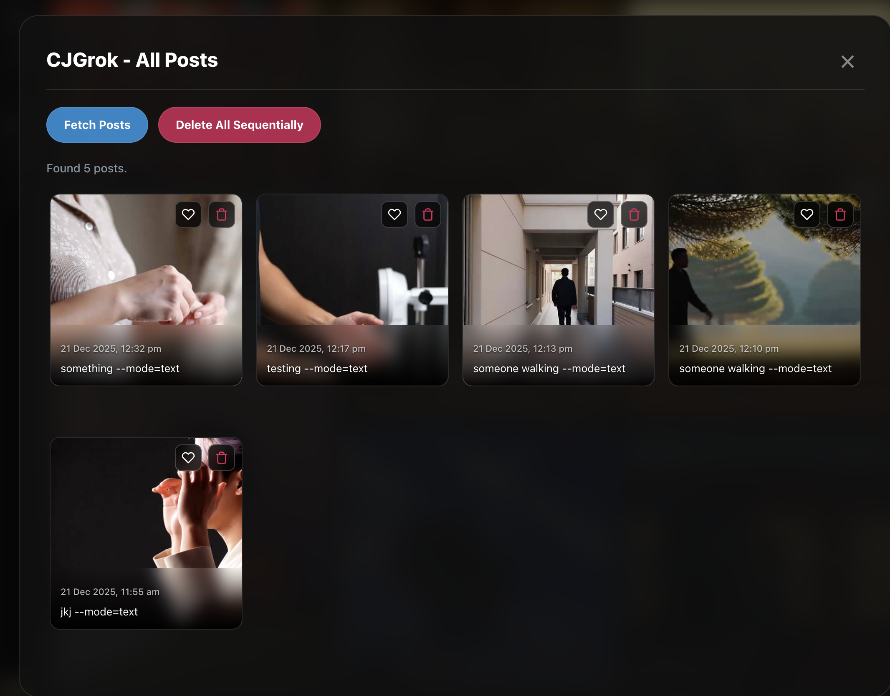
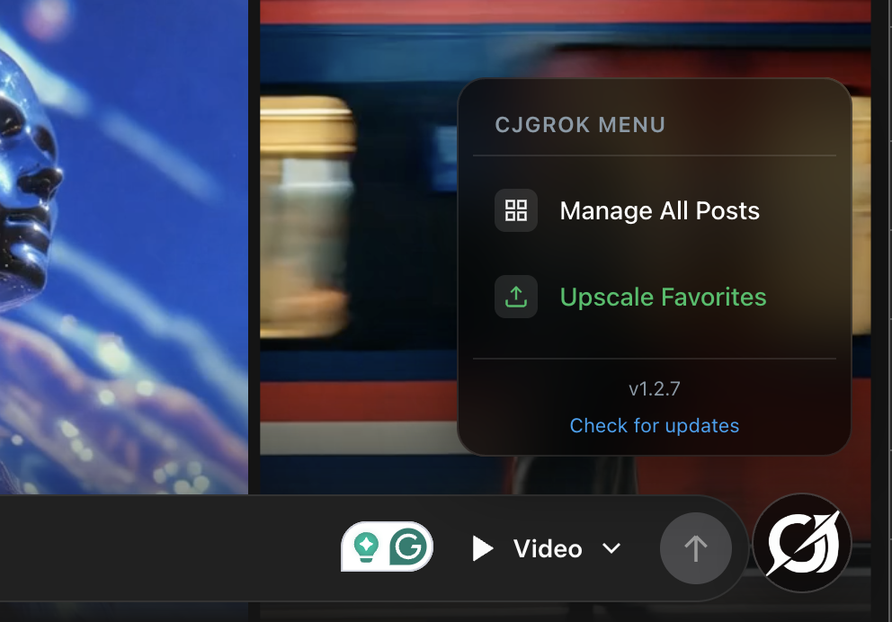
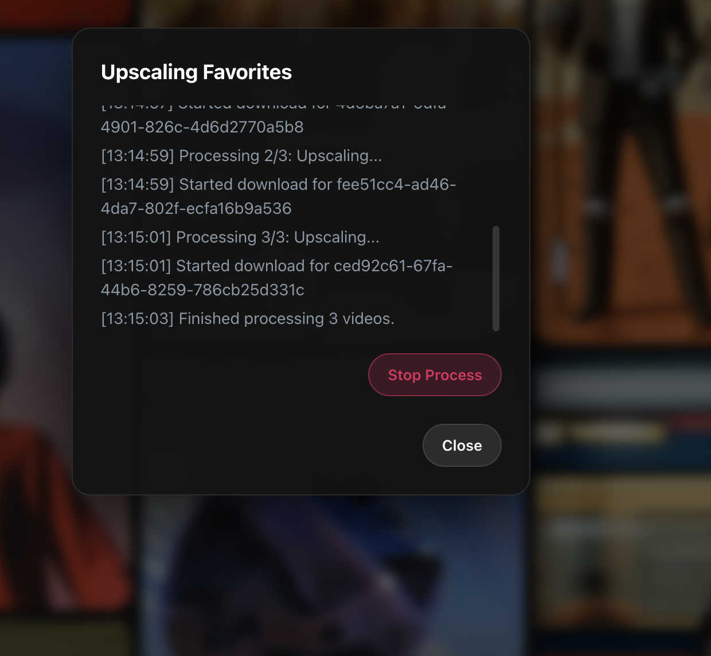

# CJGrok - Add Superpowers to Grok

<div align="center">
  
  
  <div style="display: flex; justify-content: space-between; gap: 10px; margin-top: 10px;">
    
    
  </div>
</div>

<br/>

<div align="center">

A Chrome extension that provides superpowers to Grok AI. It is designed to manage and delete your Grok Imagine posts, especially the hidden ones.

[**Features**](#features) • [**Installation**](#installation) • [**Usage**](#usage) • [**Privacy**](#privacy--security)

</div>

## Features

- ⚡ **Grok AI Superpowers**: Enhanced control over your generated content
- 🗑️ **Delete Hidden Posts**: Easily access and delete posts that are otherwise hidden in Grok Imagine
- 📸 **Gallery View**: Browse all your Grok Imagine posts in a grid layout
- 🔒 **Privacy Control**: Take control of your Grok Imagine posts

## Installation

1. Download the latest release from [GitHub Releases](https://github.com/charanjit-singh/cjgrok/releases)
2. Extract the zip file
3. Open Chrome and navigate to `chrome://extensions/`
4. Enable "Developer mode" (toggle in top right)
5. Click "Load unpacked" and select the extracted folder

## Usage

1. Navigate to [https://grok.com/imagine](https://grok.com/imagine)
2. Click the "All Posts" button in the bottom-right corner, or
3. Click the extension icon and select "Open All Posts"
4. Browse your posts, click any post to view it, or use the delete button to remove posts

## Privacy & Security

This extension addresses privacy concerns with Grok Imagine posts. For more information:

- 📰 [Reddit Discussion: Grok Imagine Privacy Issue and Fix](https://www.reddit.com/r/grok/comments/1prkx6v/grok_imagine_privacy_issue_and_fix/?utm_source=share&utm_medium=web3x&utm_name=web3xcss&utm_term=1&utm_content=share_button)
- 🎥 [YouTube Video: Grok Imagine Privacy](https://www.youtube.com/watch?v=jpvE9dfU75g&feature=youtu.be)

## Development

```bash
# Install dependencies
pnpm install

# Development mode with watch
pnpm run dev

# Build for production
pnpm run build

# Create zip file
pnpm run zip

# Version management (semver)
pnpm run version:patch  # 1.2.0 -> 1.2.1
pnpm run version:minor  # 1.2.0 -> 1.3.0
pnpm run version:major  # 1.2.0 -> 2.0.0

# Release (creates git tag and pushes)
pnpm run release:patch
pnpm run release:minor
pnpm run release:major
```

## Release Process

Releases are automated via GitHub Actions:

1. **Automatic**: Push a tag starting with `v` (e.g., `v1.2.0`) to trigger a release
2. **Manual**: Use GitHub Actions workflow dispatch with a version number

The workflow will:
- Build the extension
- Create a zip file
- Create a GitHub release with the zip file attached

## License

This project is licensed under the GNU Affero General Public License v3.0 (AGPL-3.0).

Copyright © 2025 Charanjit Singh. All Rights Reserved.

This program is free software: you can redistribute it and/or modify it under the terms of the GNU Affero General Public License as published by the Free Software Foundation, either version 3 of the License, or (at your option) any later version.

## Contributing

Contributions are welcome! Please feel free to submit a Pull Request.

## Author

Made with ❤️ by [@cjsingg](https://x.com/cjsingg)
